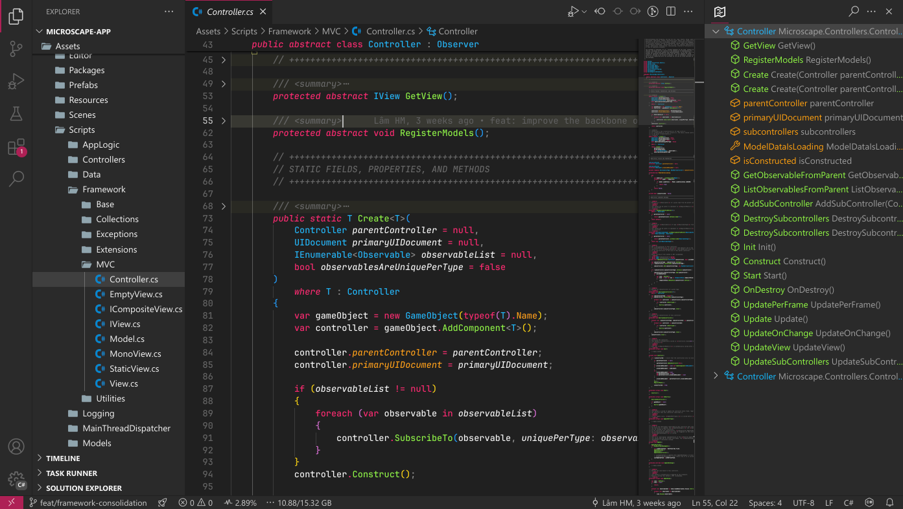
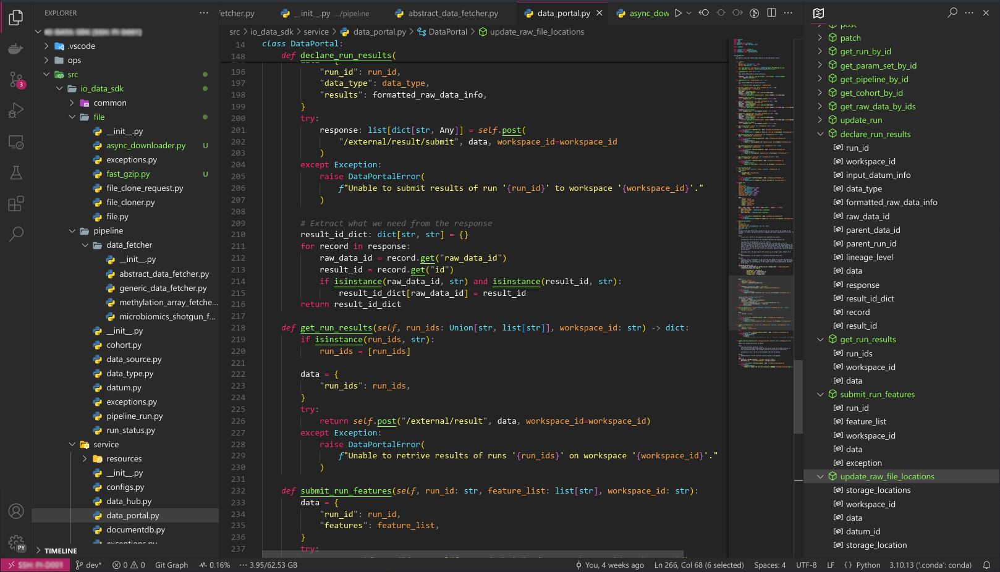

# MI Theme

This is a colour theme for Visual Studio Code that is based on the
[Monokai Accent theme](https://github.com/tw-studio/monokai-accent) and the
[Monokai Vibrant theme](https://github.com/dylantmarsh/monokai-vibrant).

The theme is designed with a focus on Python and C#. However, it also work well for other languages.

## Screenshots

### C#

### Python

