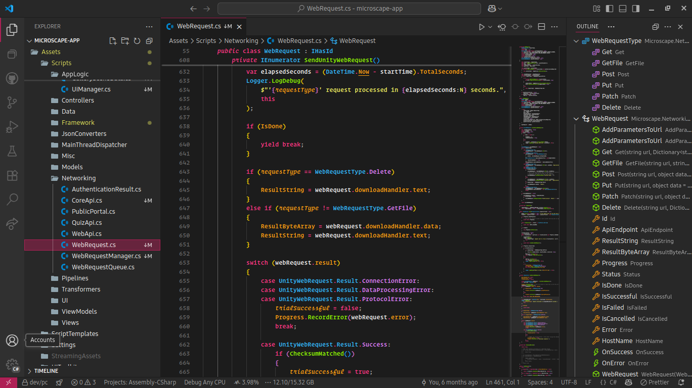

# MI Colour Theme

**MI** is specifically designed to optimize semantic highlighting for C#, C++, and Python.
While the theme also offers effective syntax highlighting for other languages,
comprehensive testing has only been concentrated on the aforementioned languages.

The dark colour scheme of **MI** draws inspirartion from the
[Monokai Accent](https://github.com/tw-studio/monokai-accent) and the
[Monokai Vibrant](https://github.com/dylantmarsh/monokai-vibrant) themes.

The light colour scheme of this theme was developed independently.

## Supported Extensions

This theme also contains colour settings for the following extensions:

- [Error Lens](https://marketplace.visualstudio.com/items?itemName=usernamehw.errorlens)
- [Outline Map](https://marketplace.visualstudio.com/items?itemName=Gerrnperl.outline-map)

## Screenshots

Please, click on the language names below to view the corresponding screenshots.

### MI Dark

C#

C++

Python

### MI Light

C#

C++

Python

